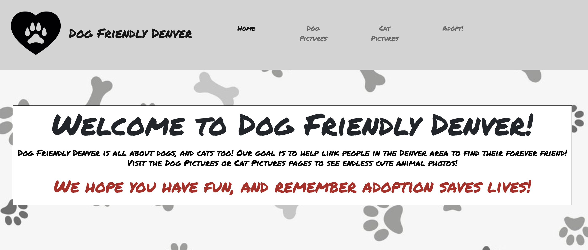
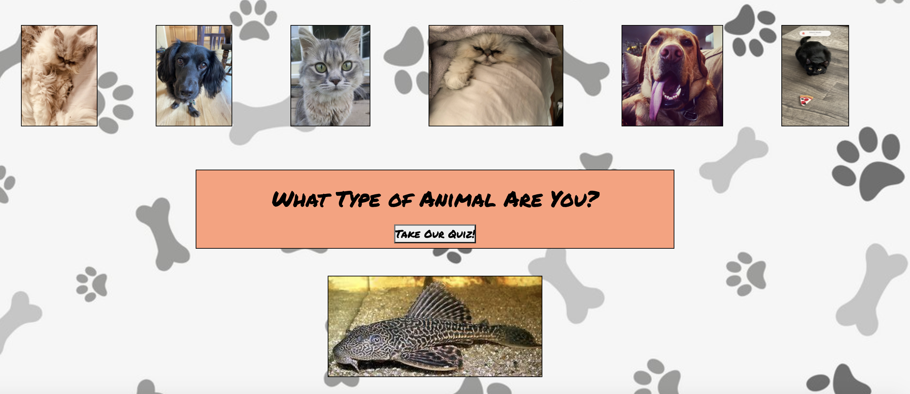
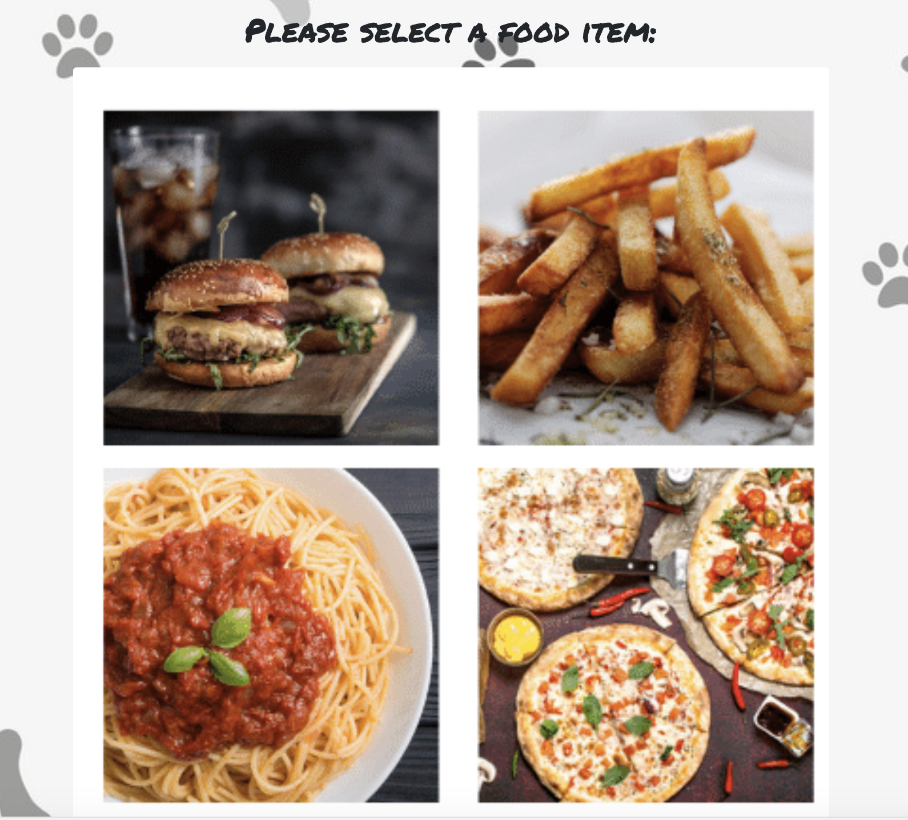
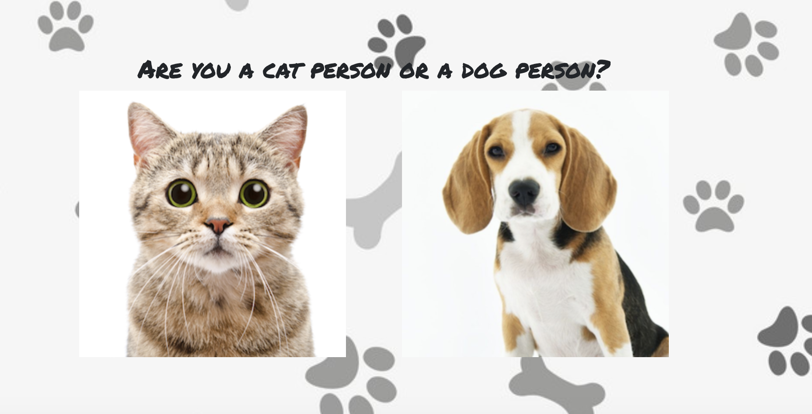
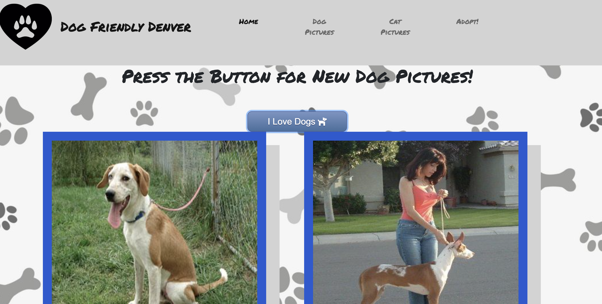
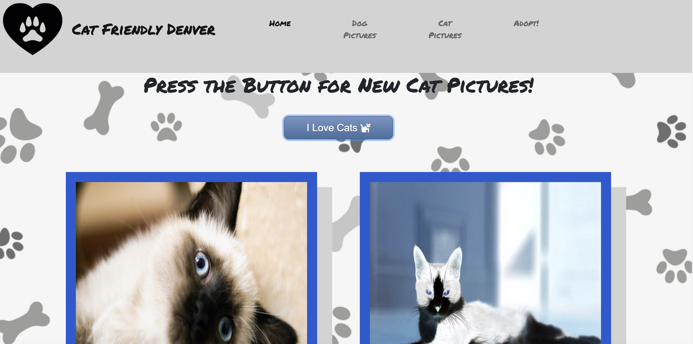
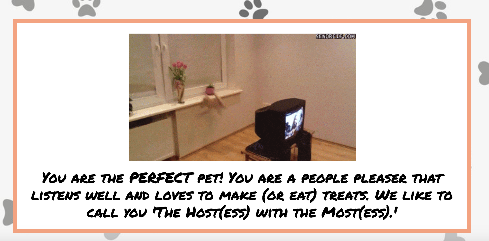
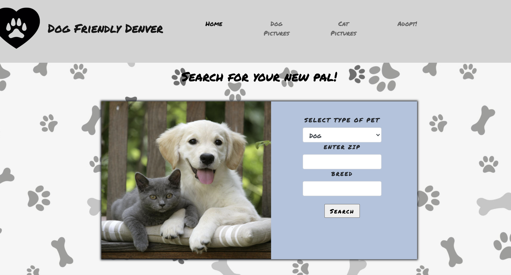
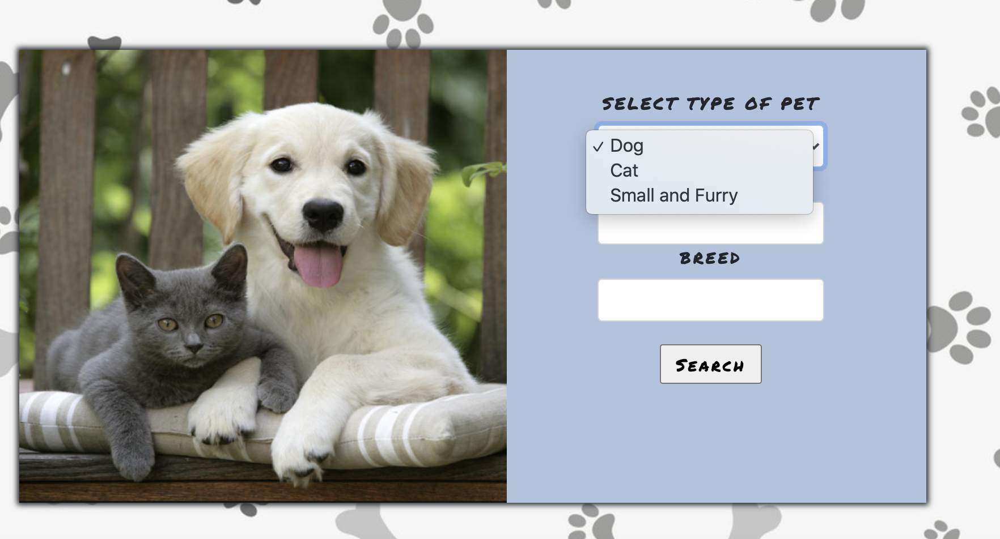
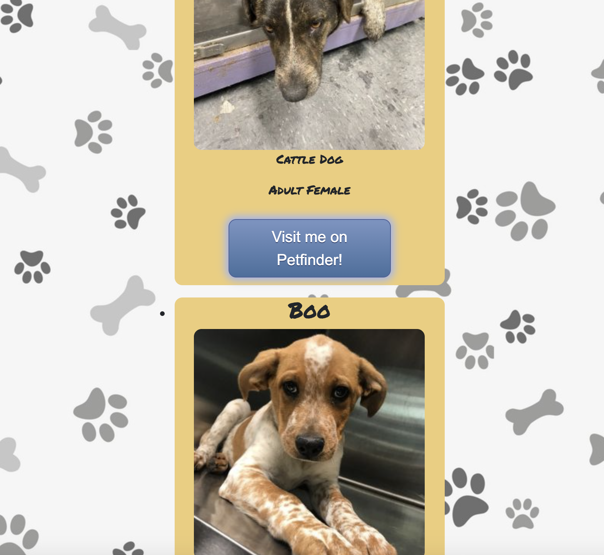

# DogFriendlyDenver

### Description
Dog Friendly Denver is an app to help both dog and cat lovers in the Denver area.  This application includes a fun quiz to see what type of dog or cat you are, pictures of dogs or cats and a serach for rescue dogs or cats near the user.

### Walk Through

The home page starts with a brief description of our site and the start quiz function.

Clicking on the start quiz button begins the quiz.  The quiz walks the user through a series of 7 questions. 6 have four choices and the last question gives the user the choice between dog and cat.  

The user input from dog or cat is tracked and a random dog or cat image and personality description is triggered by the image click.

 
The dog pictures and cat pictures pages function similarly to each other.  The user is presented with a buttong to click for images. 

 Upon click two images of either dogs or cats (depending on the page) are displayed.  

Laslty the adopt page allows the user to see local dogs, cats or small animals.  The user is prompted to select the type of animal they are looking for and to enter their zipcode.  The breed is optional and has been found to sevearly limit the search criteria (often times resulting in no animals).  

After filling out the form the user is presented with a maximum of 10 animals fitting their desired criteria.  Links under each animal allow the user to access the website that the api is provided from and get more information about the animal.

### Instalation
Several apis were used in the development of this application.  They are built into the code itself and should not require any aditional instalation.  The application was tested in chrome.  It should not requre any instalations to run.  

### Contributing
We would love to have you work on our code.  Code is never a finished product.  Pull requests are welcome.  Please be sure to dicuss with us if you plan to make major changes and always be sure to use a new branch when making changes.

### Authors
This application was created by Tony Nolan, Dana Kuglin, Joshua Thompson, Katie Anilionis, Brenda Miller and Anna Battista

### License
API's used in this project:
    Cat API Website : https://thecatapi.com/
    Dog API Website : https://dog.ceo/dog-api/
    Pet Finder API : https://api.petfinder.com/v2/animals?type=${animal}&breed=${breed}&location=${zip}&status=adoptable&distance=25&limit=50
Quiz Images are from Canva

